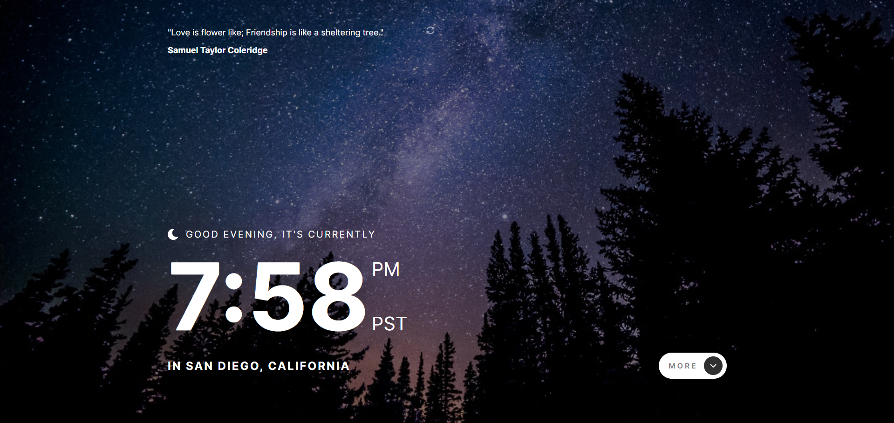
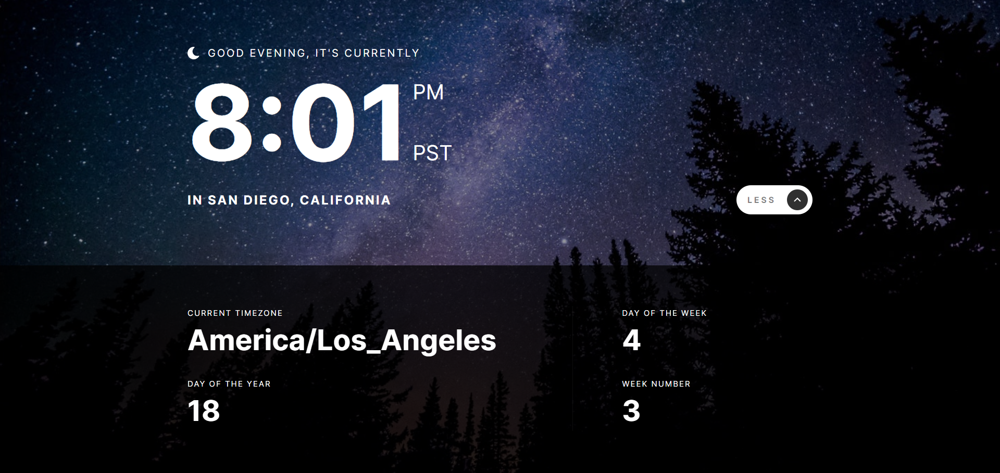

# Frontend Mentor - Clock app solution

This is a solution to the [Clock app challenge on Frontend Mentor](https://www.frontendmentor.io/challenges/clock-app-LMFaxFwrM). Frontend Mentor challenges help you improve your coding skills by building realistic projects. 

## Table of contents

- [Overview](#overview)
  - [The challenge](#the-challenge)
  - [Screenshots](#screenshots)
  - [Links](#links)
- [Built with](#built-with)
- [Author](#author)

## Overview

### The challenge

Users should be able to:

- View the optimal layout for the site depending on their device's screen size
- See hover states for all interactive elements on the page
- View the current time and location information based on their IP address
- View additional information about the date and time in the expanded state
- Be shown the correct greeting and background image based on the time of day they're visiting the site
- Generate random programming quotes by clicking the refresh icon near the quote

### Screenshots

### Links

- Solution URL: [https://github.com/cganzon/clock-app](https://github.com/cganzon/clock-app)
- Live Site URL: [https://cganzon.github.io/clock-app/](https://cganzon.github.io/clock-app/)

### Built with

- Sass
- Flexbox
- Mobile-first workflow
- [Random Quotes API](https://github.com/lukePeavey/quotable)
- [World Time API](https://worldtimeapi.org/)
- [IP Geolocation API](https://ipapi.co/)

## Author

- GitHub - [cganzon](https://github.com/cganzon)
- Frontend Mentor - [@cganzon](https://www.frontendmentor.io/profile/cganzon)
